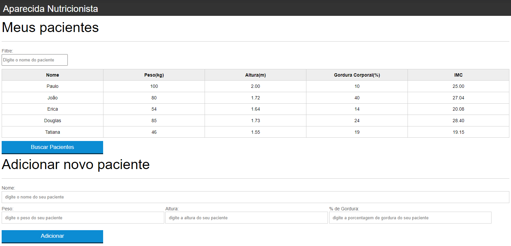


Projeto que tem como objetivo ter um controle dos paciente do nutricionista, fazendo o calculo do IMC e podendo assim adionar novo paciente ou excluir.

### Funcionalidades

- Medir Peso(kg), Altura(m), gordura corporal(%) e calcular seu IMC.
- Adicionar paciente e excluir.
- filtrar paciente pelo nome.

