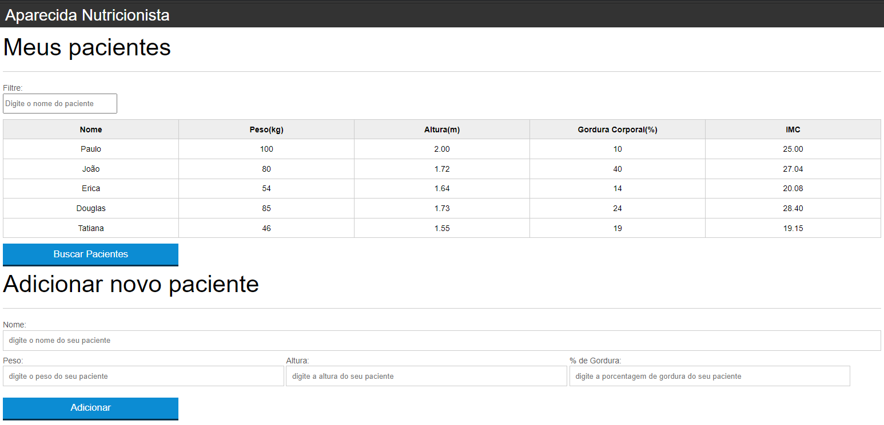

## 💻 Projeto
Aparecida Nutricionista tem o controle de seus pacientes, tendo dados de todos seus pacientes em sua planilha para auxiliar, fazendo o calculo do IMC e podendo assim adicionar novo paciente ou excluir.

## 🔖 Funcionalidades

- Medir Peso(kg), Altura(m), gordura corporal(%) e calcular seu IMC.
- Adicionar paciente e excluir.
- filtrar paciente pelo nome.

